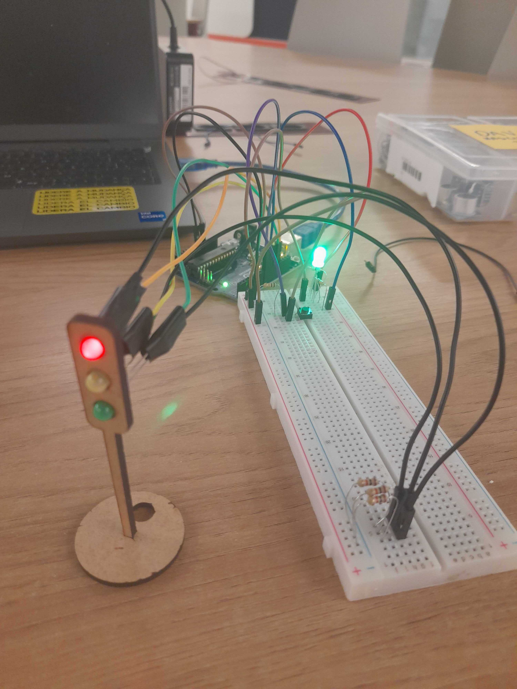
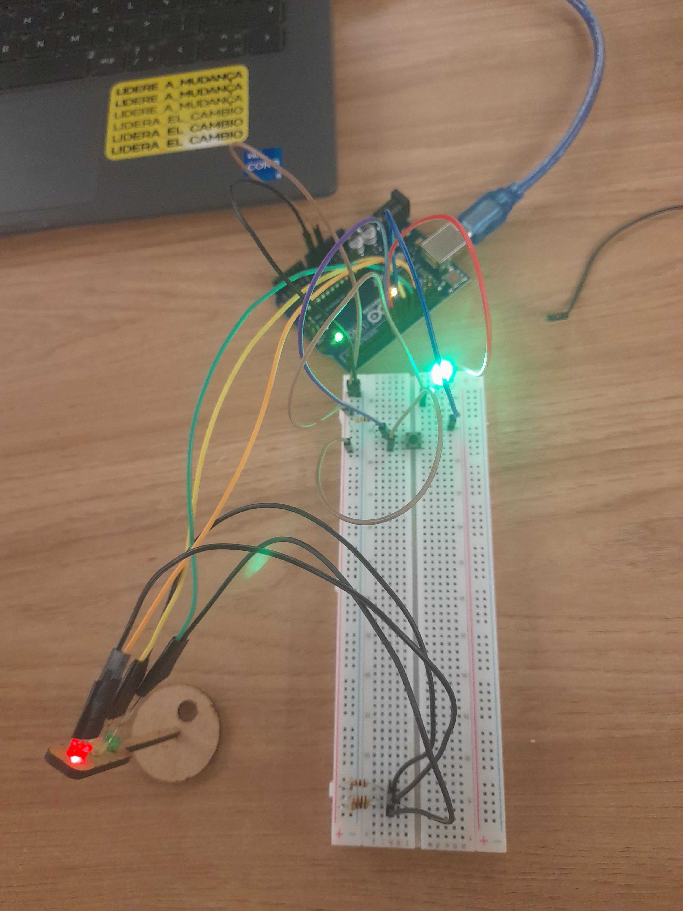
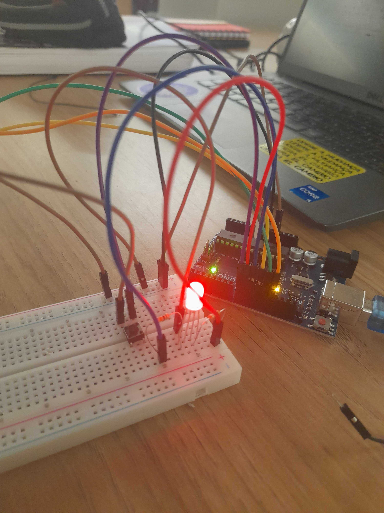

# Ponderada de Programação

&nbsp;&nbsp;&nbsp;&nbsp;Este repositório foi criado para o desenvolvimento da atividade de programação da semana 03, do módulo 4, do aluno Davi Nascimento de Jesus. A atividade foi feita sob a orientação da Prof. Me. Kizzy Terra. A atividade pode ser encontrada abaixo:

## Descrição do projeto

&nbsp;&nbsp;&nbsp;&nbsp;Este projeto envolve a montagem de um semáforo em uma protoboard, utilizando LEDs para representar as cores vermelho, amarelo e verde. Cada LED será conectado a resistores apropriados para evitar sobrecarga e proteger os componentes. A disposição dos LEDs seguirá a ordem convencional de um semáforo, permitindo que o circuito simule um sistema de sinalização. Além disso, os fios serão organizados para facilitar a visualização e manter a clareza do circuito. Um ponto extra desenvolvido foi a conexão com um semafóro para pedestres, que indica, conforme a cor do semáforo para veículos, se é possível ao pedestre atrevessar ou não.

&nbsp;&nbsp;&nbsp;&nbsp;A montagem do sistema ocorreu priorizando a aparição do semáforo na frente, cujos leds foram conectados diretamente nas portas correspondentes na placa do arduínio e o terra foi desenvolvido na protoboard com três resistores com a mesma resistência. Além disso, colocou-se em localização próxima o RGB que indica o semáforo de pedestres e também o botão, já que ambos (pelo Led RGB ser anôdo comum, como explicado pelo técnico do laboratório, André) precisam ser alimentados pelo VCC do arduíno.

&nbsp;&nbsp;&nbsp;&nbsp; É possível visualizar a montagem pelas imagens abaixo:

<div align="center">

<sub>Figura 1 - Montagem vista de frente ligada</sub>



<sup>Fonte: Material produzido pelos autores (2024)</sup>

</div>

<div align="center">

<sub>Figura 2 - Montagem vista na lateral ligada</sub>


<sup>Fonte: Material produzido pelos autores (2024)</sup>

</div>

<div align="center">

<sub>Figura 3 - Montagem vista de cima ligada</sub>



<sup>Fonte: Material produzido pelos autores (2024)</sup>

</div>

<div align="center">

<sub>Figura 4 - Montagem da sinalização de pedestres ligada</sub>



<sup>Fonte: Material produzido pelos autores (2024)</sup>

</div>

## Lista de materiais

&nbsp;&nbsp;&nbsp;&nbsp; Os seguintes materiais foram utilizados para a confecção do projeto:

<div align="center">

<sub>Tabela 1 - Tabela de componentes</sub>

| **Item**             | **Descrição**                                                    | **Quantidade** | 
|----------------------|------------------------------------------------------------------| ---------------------|
| Protoboard           | Ferramenta para a montagem de circuitos eletrônicos | 1              |                 
| LED Vermelho         | LED de cor vermelha para sinalização dos veículos |  1              | 
| LED Verde            | LED de cor verde para sinalização dos veículos  | 1              | 
| LED Amarelo          | LED de cor amarela para sinalização dos veículos| 1              |
| RGB | RGB para o semáforo dos pedestres | 1 |
| Botão                | Botão para interação com o sistema (liga/desliga) | 1              | 
| Resistores           | Resistores para controle de corrente (Resistências variadas) |  6             | 
| Jumpers              | Cabos para conexões elétricas                                    | 13                  |

<sup>Fonte: Material produzido pelos autores (2024)</sup>

</div>

&nbsp;&nbsp;&nbsp;&nbsp;No caso dos jumpers, foi desenvolvido um padrão para o sistema de semáforo proposto que pode ser visto na visualização em tabela apresentada a seguir:

<div align="center">

<sub>Tabela 2 - Padronização dos jumpers</sub>

| **Cor do Jumper**             | **Função**                                                    
|----------------------|------------------------------------------------------------------| 
| Azul        | RGB na sinalização da cor azul nos pedestres|  
| Vermelho         | RGB na sinalização da cor vermelha nos pedestres|  
| Verde            | LED mostrando cor verde para os veículos  | 
| Amarelo          | LED mostrando cor amarela para os veículos| 
| Laranja | LED mostrando cor vermelha para os veículos| 
| Roxo                | Conexão com botão |
| Marrom          | Alimentação (VCC, 5V) |  
| Preto | Fio de aterramento | 

<sup>Fonte: Material produzido pelos autores (2024)</sup>

</div>

&nbsp;&nbsp;&nbsp;&nbsp;Com os materiais dispostos acima, foi possível desenvolver a proposta da atividade ponderada.

## Código do projeto

&nbsp;&nbsp;&nbsp;&nbsp;O código desenvolvido para o projeto pode ser encontrado abaixo:

```cpp
// Define os valores das portas para os componentes correspondentes
#define LED_VERMELHO 13
#define LED_VERDE 12
#define LED_AMARELO 11
#define RGB_VERDE 10
#define RGB_VERMELHO 9
#define BUTTON 8

int buttonState = 0; // Armazena o estado atual do botão
int lastButtonState = 0; // Armazena o último estado do botão
bool semaphoreOn = false; // Define se o semáforo está ligado ou desligado
int currentState = 0;     // Armazena o estado atual do semáforo
unsigned long previousMillis = 0; // Armazena o tempo anterior
unsigned long interval = 0;       // Intervalo para cada estado do semáforo

void setup() {
  // Define os valores dos Leds e do RGB para saída
  pinMode(LED_VERDE, OUTPUT);
  pinMode(LED_AMARELO, OUTPUT);
  pinMode(LED_VERMELHO, OUTPUT);
  pinMode(RGB_VERDE, OUTPUT);
  pinMode(RGB_VERMELHO, OUTPUT);

  // Define o valor do botão para entrada
  pinMode(BUTTON, INPUT);

  // Inicia a comunicação com o terminal (para sinalização do status do semáforo além da cor)
  Serial.begin(9600);
}

void loop() {

  buttonState = digitalRead(BUTTON); // Lê o estado atual do botão

  // Detecta mudança no estado do botão (acionamento)
  if (buttonState == HIGH && lastButtonState == LOW) {
    semaphoreOn = !semaphoreOn; // Alterna o estado do semáforo
    previousMillis = millis();  // Coloca o valor de millis durante o acionamento como referência
    currentState = 0;           // Reinicia a sequência
    delay(50); // Anti-repique para evitar múltiplos acionamentos acidentais
  }

  lastButtonState = buttonState; // Atualiza o último estado do botão

  if (semaphoreOn) {
    // Executa a sequência do semáforo usando millis()
    unsigned long currentMillis = millis();
 
    switch (currentState) {
      case 0:
        // Estado do LED Vermelho (sinal fechado para motoristas, verde para pedestres)
        if (currentMillis - previousMillis >= 6000) {
          // Após 6 segundos, muda para o próximo estado (amarelo para motoristas, vermelho para pedestres)
          previousMillis = currentMillis; // Atualiza o tempo de referência
          digitalWrite(LED_VERMELHO, LOW); // Desliga o LED vermelho
          digitalWrite(RGB_VERDE, LOW); // Desliga o LED verde do RGB (pedestre)
          digitalWrite(LED_AMARELO, HIGH); // Liga o LED amarelo (atenção)
          digitalWrite(RGB_VERMELHO, HIGH); // Liga o RGB vermelho (pedestre)
          interval = 2000; // Define o intervalo para o próximo estado (2 segundos)
          currentState = 1; // Atualiza para o próximo estado
        } else {
          // Enquanto o intervalo de 6 segundos não for atingido, mantém o LED vermelho ligado
          digitalWrite(LED_VERMELHO, HIGH); // Liga o LED vermelho
          digitalWrite(RGB_VERDE, HIGH); // Liga o RGB verde (pedestre)
          Serial.println("Fechado - Aguarde..."); // Exibe mensagem no terminal
        }
        break;

      case 1:
        // Estado do LED Amarelo após o Vermelho (pedestre vermelho)
        if (currentMillis - previousMillis >= interval) {
          // Após o intervalo de 2 segundos, muda para o próximo estado (verde para motoristas, vermelho para pedestres)
          previousMillis = currentMillis; // Atualiza o tempo de referência
          digitalWrite(LED_AMARELO, LOW); // Desliga o LED amarelo
          digitalWrite(RGB_VERMELHO, LOW); // Desliga o RGB vermelho (pedestre)
          digitalWrite(LED_VERDE, HIGH); // Liga o LED verde (sinal aberto para motoristas)
          digitalWrite(RGB_VERMELHO, HIGH); // Liga o RGB vermelho (pedestre)
          interval = 2000; // Define o intervalo para o próximo estado (2 segundos)
          currentState = 2; // Atualiza para o próximo estado
        } // Não precisa de else, porque os leds já foram ligados no case acima

        Serial.println("Abrindo em breve..."); // Exibe mensagem no terminal
        break;

      case 2:
        // Estado do LED Verde (sinal aberto para motoristas, pedestre vermelho)
        if (currentMillis - previousMillis >= interval) {
          // Após o intervalo de 2 segundos, muda para o próximo estado (amarelo para motoristas)
          previousMillis = currentMillis; // Atualiza o tempo de referência
          digitalWrite(LED_VERDE, LOW); // Desliga o LED verde
          digitalWrite(LED_AMARELO, HIGH); // Liga o LED amarelo (atenção)
          interval = 2000; // Define o intervalo para o próximo estado (2 segundos)
          currentState = 3; // Atualiza para o próximo estado
        }
        Serial.println("Aberto - Siga"); // Exibe mensagem no terminal
        break;

      case 3:
        // Estado do LED Amarelo após o Verde (pedestre vermelho)
        if (currentMillis - previousMillis >= interval) {
          // Após o intervalo de 2 segundos, retorna ao primeiro estado (vermelho para motoristas, verde para pedestres)
          previousMillis = currentMillis; // Atualiza o tempo de referência
          digitalWrite(LED_AMARELO, LOW); // Desliga o LED amarelo
          digitalWrite(RGB_VERMELHO, LOW); // Desliga o RGB vermelho (pedestre)
          currentState = 0; // Reinicia a sequência
        }
        Serial.println("Fechando..."); // Exibe mensagem no terminal
        break;
    }
  } else {
    Serial.println("O sistema está desligado.");
    // Garante que todos os LEDs estejam apagados quando o semáforo está desligado
    digitalWrite(LED_VERDE, LOW);
    digitalWrite(LED_AMARELO, LOW);
    digitalWrite(LED_VERMELHO, LOW);
    digitalWrite(RGB_VERDE, LOW);
    digitalWrite(RGB_VERMELHO, LOW);
  }
}
```

## Vídeo de Funcionamento

&nbsp;&nbsp;&nbsp;&nbsp;Para demonstrar o funcionamento do protótipo, foi gravado um vídeo de sua execução. No vídeo, abaixo, é possível perceber então a função do botão de acionar o sistema (o RGB na cor amarela indica que o sistema está desligado), bem como a transição em paralelo entre os semáforos de veículos e de pedestres. É possível perceber também que é possível desativar o sistema, também, pressionando o botão.

<div align="center">

<sub>Vídeo 1 - Funcionamento do Semáforo</sub>

[🖱️| Clique aqui para acessar o vídeo no Google Drive](https://drive.google.com/file/d/1_larTrrl4mNU1KgkCRJ5bS5IDffd-Dd_/view?usp=sharing)

<sup>Fonte: Material produzido pelos autores (2024)</sup>

</div>

## Avaliações dos colegas

&nbsp;&nbsp;&nbsp;&nbsp;Foram desenvolvidas solicitações para dois colegas revisarem e avaliarem o projeto. Os registros dessas avaliações podem ser vistos abaixo:

### Matheus Fernandes Guimarães

| Critério                                                                                                 | Contempla (Pontos) | Contempla Parcialmente (Pontos) | Não Contempla (Pontos) | Observações do Avaliador |
|---------------------------------------------------------------------------------------------------------|--------------------|----------------------------------|--------------------------|---------------------------|
| Montagem física com cores corretas, boa disposição dos fios e uso adequado de resistores                | Até 3              | Até 1,5                            | 0                        |  Nota: 3 - O protótipo tem os fios organizados com as cores corretas e utiliza os resistores da forma certa                        |
| Temporização adequada conforme tempos medidos com auxílio de algum instrumento externo                  | Até 3              | Até 1,5                          | 0                        |    Nota: 3 - A aplicação tem a temporização correta dos leds descrita nas orientações da ponderada                      |
| Código implementa corretamente as fases do semáforo e estrutura do código (variáveis representativas e comentários) | Até 3              | Até 1,5                          | 0                        |  Nota: 3 - O código está completo e foi além, adicionando funcionalidades como o millis.                         |
| Extra: Implmeentou um componente de liga/desliga no semáforo e/ou usou ponteiros no código | Até 1              |  Até 0,5                         | 0                        |  Nota: 1 - O aluno implementou um botão no protótipo                       |
|  |                                                             |  | |*Pontuação Total: 10*|


### Yasmim Marly Passos
| Critério                                                                                                 | Contempla (Pontos) | Contempla Parcialmente (Pontos) | Não Contempla (Pontos) | Observações do Avaliador                                        |
|----------------------------------------------------------------------------------------------------------|--------------------|----------------------------------|--------------------------|------------------------------------------------------------------|
| Montagem física com cores corretas, boa disposição dos fios e uso adequado de resistores                 | Até 3              | Até 1,5                          | 0                        | Nota 3: A montagem foi feita corretamente com uma boa disposição dos fios. Ele seguiu um padrão de cor que criou, como usar fios marrom para o 5V, e manteve esse padrão de forma consistente. A montagem das cores dos LEDs está correta e os resistores certos foram usados para evitar danos aos componentes. |
| Temporização adequada conforme tempos medidos com auxílio de algum instrumento externo                   | Até 3              | Até 1,5                          | 0                        | Nota 3: A temporização ficou adequada, sendo verificada tanto pela lógica do código quanto por cronômetro. Os tempos seguiram corretamente 6 segundos no vermelho, 2 segundos no amarelo e 4 segundos no verde. |
| Código implementa corretamente as fases do semáforo e estrutura do código (variáveis representativas e comentários) | Até 3              | Até 1,5                          | 0                        | Nota 3: O código implementa corretamente as fases do semáforo e faz uso de boas variáveis, como buttonState e lastButtonState, além de conter comentários bem descritivos que facilitam o entendimento do funcionamento. |
| Extra: Implementou um componente de liga/desliga no semáforo e/ou usou ponteiros no código               | Até 1              | Até 0,5                          | 0                        | Nota 1: Ele adicionou um botão que liga e desliga o semáforo e, como um extra, implementou um LED adicional para os pedestres. |
|  |                                                             |  | |*Pontuação Total: 10*|

#
&nbsp;&nbsp;&nbsp;&nbsp;Com esses registros, então, conclui-se o desenvolvimento da atividade ponderada. Através dela, foi possível solidificar o entendimento de alguns aprendizados sobre eletrônica básica, bem como reforços na contextualização da linguagem de programação C++. Assim, tornou-se mais robusta a bagagem de conhecimentos necessários para o desenvolvimento do projeto do módulo 4.
